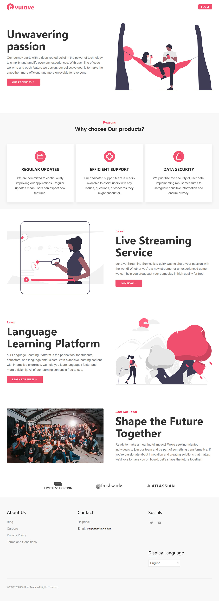

<a href="https://vultive.com/">
    
</a>

# vultive-com



## Links

- [Website](https://vultive.com)

## Setup

Make sure to install the dependencies:

```bash
# yarn
yarn install

# npm
npm install

# pnpm
pnpm install
```

## Development Server

Start the development server

```bash
npm run dev
```

## Production

Build the application for production:

```bash
npm run build
```
